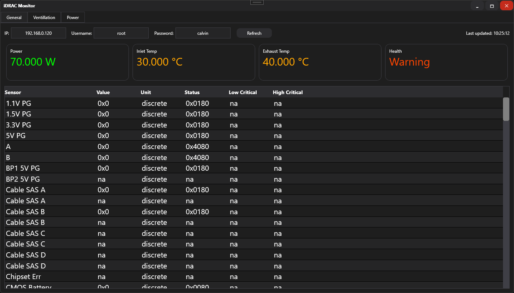
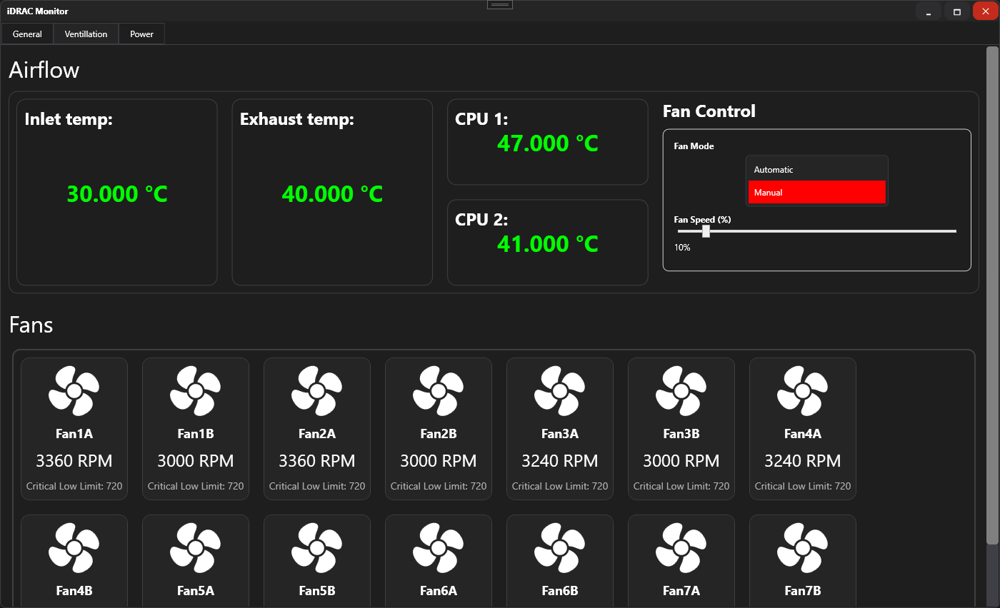
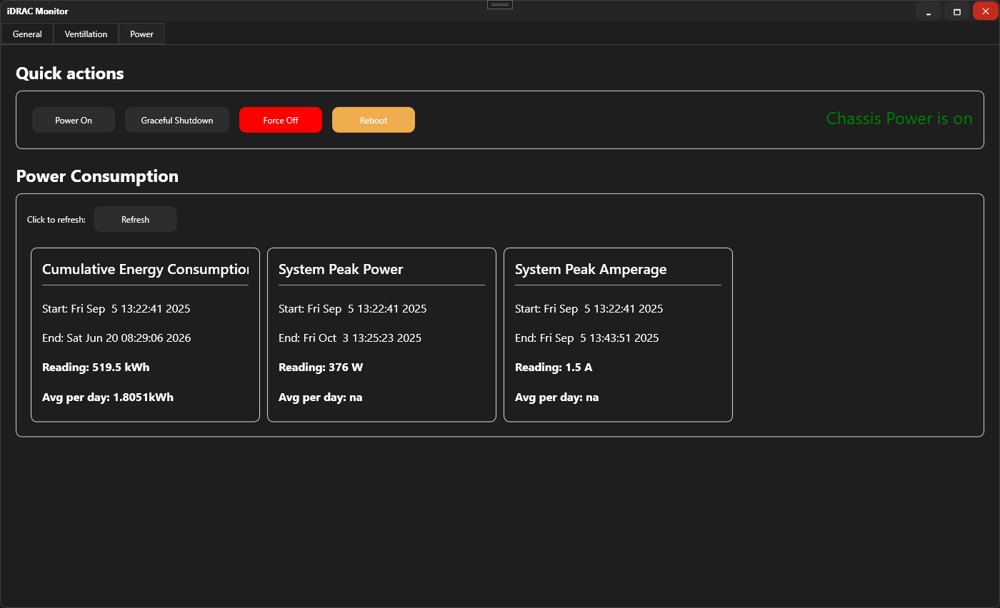

# iDRAC_GUI
A simple graphical interface for iDRAC/IPMI tool based on WPF and C#

# How to use?
Before pulling source, make sure, that you have your ipmitool at this location: `C:\ipmitool\ipmitool.exe` (you can customize path in source)\
Pull the source code and and build it. On startup no data will be visible. To fetch the data type in the correct `ip address`, `username`, `password` and click `Refresh`\
Wait, until the loading screen goes away and the new data appears.\
\
Clicking refresh will fetch the following data:
- Sensor info on General tab
- Temperature and Fanspeed in Ventillation tab
- Chassis power state in Power tab

To check power consumption, under `Power` tab, click `Refresh` in `Power Consumption` box

# Images

| General Tab | Ventilation Tab  |
|-------------|------------------|
|  |  |
| *General tab view after data fetch* | *Ventilation tab view after data fetch* |

| Power Tab |
|-----------|
|  |
| *Power tab view after data fetch* |